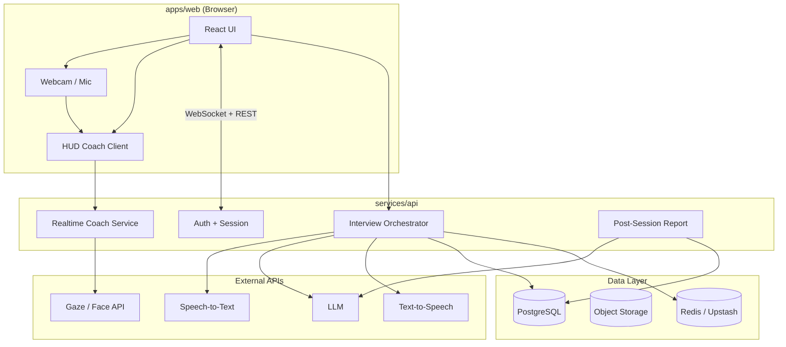
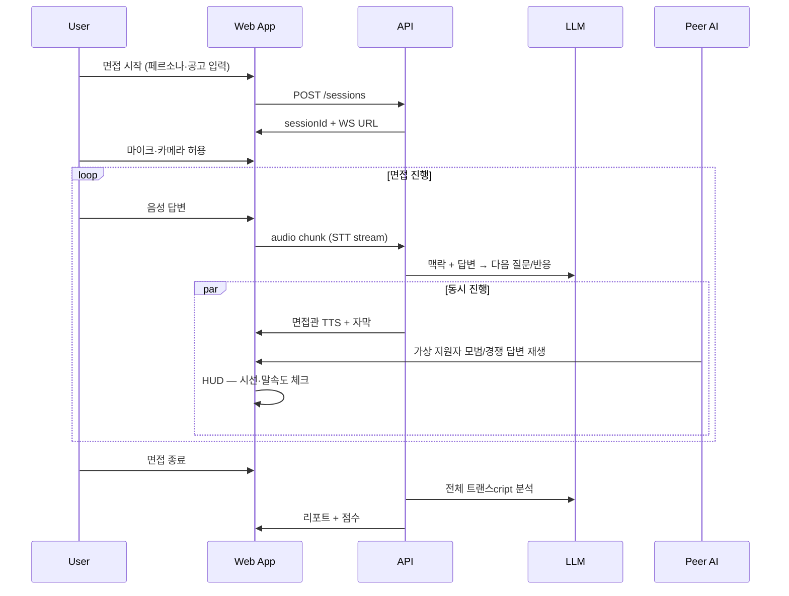

# MAJU 실제 서비스 구현 계획

> 다대다 압박 면접 AI 시뮬레이터 **MAJU**의 `apps/web` 제품 구현 로드맵  
> 작성 기준: 2026-08-27 · 현재 상태: 랜딩(Waitlist) 완료, 서비스 웹 스캐폴드만 존재

---

## 1. 제품 목표

### 1.1 한 줄 정의

**실전 다대다 면접장의 긴장감·경쟁·압박을 재현하고, 실시간 코칭과 맞춤형 AI 면접관으로 멘탈과 답변력을 훈련하는 웹 서비스.**

### 1.2 랜딩에서 약속한 3대 핵심 가치

| # | 기능 | 사용자가 느껴야 하는 것 |
|---|------|------------------------|
| 1 | **피어 프레셔(Peer Pressure)** | 옆 지원자가 더 유창하게 답할 때 흔들리지 않는 멘탈 |
| 2 | **실시간 HUD 코치** | 시선·말 속도 이탈 시 즉각적인 조용한 가이드 |
| 3 | **AI 면접관 페르소나** | 채용 공고·족보 기반 맞춤 질문·압박 강도 |

### 1.3 MVP 성공 기준

- [ ] 사용자가 **한 번의 면접 세션**을 처음부터 끝까지 완료할 수 있다
- [ ] **3~4인 화면**(나 + AI 면접관 + 가상 지원자 2명)이 동시에 느껴진다
- [ ] **실시간 HUD**가 말 속도·시선 이탈을 감지해 경고를 표시한다
- [ ] 세션 종료 후 **요약 리포트**(강점·약점·개선 포인트)를 받을 수 있다
- [ ] Waitlist 사전신청자(선착순 100명)에게 **프리미엄 패스**를 부여할 수 있다

---

## 2. 현재 코드베이스 현황

```
MAJU/
├── apps/landing/     ✅ Waitlist 랜딩 (ko/en/ja, SheetDB, Vercel 배포)
├── apps/web/         🔲 스캐폴드만 (React 19 + Vite + Tailwind 4)
└── docs/             📄 본 문서
```

**이미 확보된 자산**

- 브랜드 카피·UX 컨셉 (`apps/landing/src/i18n.js`)
- 디자인 토큰: `#2AD175`, `#E3F58F`, `#2A2A2A`, `#64748B` 등
- 면접 UI 목업 (랜딩의 비디오/참가자 그리드 섹션)
- 모노레포 + Vercel 2프로젝트 배포 전략 (`README.md`)

**아직 없는 것**

- 백엔드 / DB / 인증
- AI 파이프라인 (STT, LLM, TTS, 아바타)
- WebRTC·미디어 처리
- 결제·구독

---

## 3. 아키텍처 개요

### 3.1 권장 구조 (모노레포 확장)

```
MAJU/
├── apps/
│   ├── landing/          # 기존 유지
│   └── web/                # React SPA — 면접 UI, 대시보드
├── packages/
│   ├── ui/                 # 공유 컴포넌트 (Button, HUD, ParticipantTile …)
│   ├── config/             # ESLint, Tailwind preset
│   └── types/              # 세션·페르소나·리포트 공유 타입
├── services/
│   └── api/                # Node.js (Fastify/Hono) 또는 Python (FastAPI)
└── docs/
```

**왜 API를 분리하는가**

- OpenAI / Anthropic / ElevenLabs 등 **API 키를 클라이언트에 노출하면 안 됨**
- 면접 세션 상태·녹화 메타·결제는 **서버에서 권한 검증** 필요
- STT/TTS·LLM 오케스트레이션은 **지연 시간·비용** 관리가 핵심

### 3.2 런타임 다이어그램



### 3.3 실시간 면접 세션 흐름



---

## 4. 기술 스택 제안

### 4.1 프론트엔드 (`apps/web`)

| 영역 | 선택 | 이유 |
|------|------|------|
| 프레임워크 | React 19 + Vite | 랜딩과 동일, 학습 비용 최소 |
| 스타일 | Tailwind CSS 4 | 랜딩과 디자인 시스템 공유 |
| 라우팅 | React Router v7 | 대시보드·세션·설정 분리 |
| 상태 | Zustand + TanStack Query | 세션 UI vs 서버 데이터 분리 |
| 실시간 | native WebSocket | 면접 이벤트 스트림 |
| 미디어 | `getUserMedia` + MediaRecorder | 카메라·녹음 |
| HUD 분석 | MediaPipe Face Mesh (클라이언트) | 시선·얼굴 각도, 서버 왕복 지연 회피 |

### 4.2 백엔드 (`services/api`)

| 영역 | 1차(MVP) | 확장 시 |
|------|----------|---------|
| 런타임 | Node.js + Hono | 그대로 또는 Python FastAPI |
| DB | Supabase (Postgres) | RDS 등 이전 가능 |
| Auth | Supabase Auth (Email + Google) | SSO 확장 |
| 캐시/세션 | Upstash Redis | 면접 중 ephemeral state |
| 파일 | Supabase Storage / R2 | 녹화·리포트 PDF |
| 배포 | Vercel Serverless Functions **또는** Railway/Fly.io | WebSocket 상시 연결 필요 시 Fly/Railway |

> **WebSocket 주의**: Vercel Serverless만으로는 장시간 WS가 불리할 수 있음. MVP는 **짧은 턴 기반 HTTP + SSE**로 시작하고, Phase 2에서 전용 WS 서버 분리 검토.

### 4.3 AI / 음성

| 기능 | MVP 후보 | 비고 |
|------|----------|------|
| STT | OpenAI Realtime API 또는 Deepgram | 한국어·일본어·영어 |
| LLM | GPT-4o / Claude Sonnet | 페르소나·꼬리질문·동적 시나리오 |
| TTS | OpenAI TTS / ElevenLabs | 면접관·가상 지원자 음성 분리 |
| Peer 답변 | LLM 생성 + TTS 큐 | "모범 답변" / "경쟁자" 톤 다르게 |
| 리포트 | LLM 배치 분석 | 세션 transcript → 구조화 JSON |
| 시선·속도 | MediaPipe (client) + 간단 휴리스틱 | 서버 Vision API는 Phase 2 |

---

## 5. 핵심 기능 상세

### 5.1 사용자 여정 (User Flow)

```
[비로그인] → 랜딩(app.maju.com 링크) → 로그인/회원가입
    → 온보딩 (목표: 취업/대학원/일반, 언어)
    → 대시보드
        → 새 면접 만들기
            → (1) 채용 공고/족보 붙여넣기 또는 파일 업로드
            → (2) 면접관 페르소나 선택 (온화 / 압박 / 꼬리질문)
            → (3) 난이도·가상 지원자 수·언어
            → (4) 장치 테스트 (mic/cam)
        → 면접 진행 (15~30분)
        → 결과 리포트
    → 히스토리 / 재도전 / 설정
```

### 5.2 화면 목록 (`apps/web`)

| Route | 화면 | 우선순위 |
|-------|------|----------|
| `/login`, `/signup` | 인증 | P0 |
| `/onboarding` | 최초 1회 설정 | P1 |
| `/dashboard` | 세션 목록·새 면접 CTA | P0 |
| `/interview/new` | 면접 설정 마법사 | P0 |
| `/interview/:id/lobby` | 장치 테스트 | P0 |
| `/interview/:id/live` | **핵심** 4분할 면접 UI + HUD | P0 |
| `/interview/:id/report` | 결과·피드백 | P0 |
| `/settings` | 프로필·구독·언어 | P1 |
| `/billing` | 플랜·결제 | P2 |

### 5.3 Live Interview UI (랜딩 목업 → 제품화)

랜딩 `video` 섹션 레이아웃을 그대로 제품화:

```
┌─────────────────────────────────────────────────────┐
│  MAJU · 다대다 면접          [종료]  [HUD ●]        │
├──────────────┬──────────────┬──────────────┬────────┤
│   나 (Webcam)│ AI 면접관    │ 가상 지원자1 │ 가상 2 │
│   실시간     │ TTS+아바타   │ 모범 답변    │ 경쟁자 │
├──────────────┴──────────────┴──────────────┴────────┤
│  자막 / 현재 질문                                    │
│  [Mic] [Cam]                                         │
└─────────────────────────────────────────────────────┘
     ↑ HUD 오버레이: "시선 고정", "말 속도 ↑"
```

**구현 포인트**

- **Peer Pressure 타이밍**: 사용자 답변 직후 또는 중간에 가상 지원자 "유창한 답변" 재생 → 심리적 압박
- **면접관**: 사용자 transcript를 반영한 **동적 꼬리 질문** (스크립트 고정 X)
- **HUD**: `requestAnimationFrame` + Face landmarks → 시선 이탈 score, 오디오 RMS → 말 속도

### 5.4 AI 면접관 페르소나

```typescript
// packages/types — 예시
type PersonaId = 'gentle' | 'pressure' | 'followup';

interface InterviewConfig {
  jobPostingText?: string;
  cheatSheetText?: string;
  persona: PersonaId;
  language: 'ko' | 'en' | 'ja';
  peerIntensity: 'low' | 'medium' | 'high';
  durationMinutes: 15 | 30 | 45;
}
```

**시스템 프롬프트 구조**

1. Base: 다대다 면접관 역할, 언어, 시간 제한
2. Persona layer: tone, interrupt frequency, follow-up depth
3. Context layer: 공고·족보에서 추출한 competency keywords
4. Session memory: 이전 Q&A transcript (Redis or DB)

### 5.5 세션 종료 리포트

| 섹션 | 내용 |
|------|------|
| 종합 점수 | 100점 만점 (structure, clarity, confidence, relevance) |
| Peer Pressure 대응 | 옆 답변 후 흔들림 구간 타임라인 |
| HUD 이벤트 | 시선 이탈 N회, 말 속도 급상승 N회 |
| 질문별 피드백 | 답변 요약 + 개선 예시 |
| 다음 추천 | 약한 competency 기반 재연습 제안 |

---

## 6. 데이터 모델 (초안)

```sql
-- users: Supabase auth.users 확장
profiles (
  id uuid PK references auth.users,
  display_name text,
  locale text default 'ko',
  onboarding_done boolean default false,
  plan text default 'free',  -- free | premium | waitlist_lifetime
  created_at timestamptz
);

interview_sessions (
  id uuid PK,
  user_id uuid FK,
  status text,  -- draft | live | completed | aborted
  config jsonb,  -- InterviewConfig
  started_at timestamptz,
  ended_at timestamptz,
  report jsonb,
  created_at timestamptz
);

session_turns (
  id uuid PK,
  session_id uuid FK,
  role text,  -- user | interviewer | peer1 | peer2 | hud
  content text,
  audio_url text,
  metadata jsonb,  -- hud scores, timestamps
  created_at timestamptz
);

subscriptions (
  id uuid PK,
  user_id uuid FK,
  stripe_customer_id text,
  stripe_subscription_id text,
  status text,
  current_period_end timestamptz
);

waitlist_grants (
  email text PK,
  granted_at timestamptz,
  redeemed_by uuid FK  -- profiles.id, nullable until signup
);
```

---

## 7. API 설계 (초안)

| Method | Path | 설명 |
|--------|------|------|
| POST | `/auth/*` | Supabase 위임 |
| GET | `/me` | 프로필·플랜 |
| POST | `/sessions` | 면접 생성 |
| GET | `/sessions` | 목록 |
| GET | `/sessions/:id` | 상세 |
| POST | `/sessions/:id/start` | live 전환 |
| WS/SSE | `/sessions/:id/stream` | STT partial, AI 응답, peer 이벤트 |
| POST | `/sessions/:id/end` | 종료 + 리포트 생성 job |
| GET | `/sessions/:id/report` | 리포트 조회 |
| POST | `/waitlist/redeem` | 이메일로 프리미엄 패스 활성화 |

---

## 8. 구현 단계 (Phased Roadmap)

### Phase 0 — 기반 작업 (1~2주)

- [x] `packages/ui`, `packages/types` 추출 (랜딩·웹 공통 컴포넌트)
- [x] `apps/web` 라우팅·레이아웃·인증 shell
- [ ] Supabase 프로젝트 생성 (Auth + DB) — **로컬에서 대시보드로 생성 필요** ([supabase/README.md](../supabase/README.md))
- [x] `services/api` 스캐폴드 + 로컬 dev (`npm run dev:api`)
- [x] 환경 변수 규칙 (`.env.example`)

### Phase 1 — MVP Core (4~6주)

**목표: "동작하는 한 판"**

- [x] 로그인 / 회원가입
- [x] 면접 설정 (공고 텍스트 + 페르소나) — Step 1
- [x] Live UI (4타일, webcam, mic) — Step 2
- [ ] STT → LLM → TTS 루프 (면접관 1명만, peer는 텍스트+TTS 프리셋)
- [ ] 클라이언트 HUD (말 속도 + 기본 시선)
- [ ] 세션 저장 + 간단 리포트 (LLM 텍스트)
- [x] 대시보드 (past sessions) — Step 1 목록

### Phase 2 — 차별화 기능 (3~4주)

- [ ] **동적 Peer Pressure** (LLM 생성 rival/model answers)
- [ ] 페르소나 3종 완성 + 꼬리질문 깊이 조절
- [ ] 리포트 고도화 (점수·타임라인·질문별)
- [ ] 다국어 UI (랜딩 i18n 재사용)
- [ ] Waitlist → Premium pass redeem flow

### Phase 3 — 상용화 (3~4주)

- [ ] Stripe 구독 (Free tier: 월 N회 / Premium: unlimited)
- [ ] 사용량·비용 모니터링 (세션당 LLM/TTS cap)
- [ ] 녹화 opt-in + Storage
- [ ] 성능·접근성·모바일 대응 (태블릿 우선)
- [ ] 에러 복구 (네트워크 끊김, mid-session resume)

### Phase 4 — 확장 (이후)

- [ ] 기업/학교 B2B (팀 대시보드)
- [ ] 커스텀 아바타 / lip-sync
- [ ] 모의 면접 시나리오 마켓플레이스
- [ ] 네이티브 앱 (React Native)

---

## 9. 비용·과금 가정

### 9.1 세션당 변동비 (15분, 대략)

| 항목 | 추정 |
|------|------|
| STT | $0.05 ~ 0.15 |
| LLM (대화+리포트) | $0.10 ~ 0.40 |
| TTS | $0.05 ~ 0.20 |
| **합계** | **~$0.20 ~ 0.75 / 세션** |

→ Free tier는 **월 2~3회 제한**, Premium은 unlimited + fair use cap 필요.

### 9.2 요금제 (초안)

| Plan | 가격 | 내용 |
|------|------|------|
| Free | ₩0 | 월 2회, 15분, 기본 페르소나 |
| Premium | ₩9,900~19,900/월 | unlimited, 30분, 전 페르소나, 상세 리포트 |
| Waitlist Lifetime | ₩0 (100명) | Premium 1년 (랜딩 약속) |

---

## 10. 인프라·배포

| 서비스 | 호스팅 | 도메인 |
|--------|--------|--------|
| Landing | Vercel (`maju-landing`) | maju.com |
| Web | Vercel (`maju-web`) | app.maju.com |
| API | Railway / Fly.io / Supabase Edge | api.maju.com |
| DB/Auth | Supabase | — |

**CI/CD**

- GitHub Actions: lint → typecheck → build (landing + web + api)
- Preview deploy: PR마다 Vercel preview

**Secrets**

- 랜딩: SheetDB (현재 코드 내 URL → 추후 env 이전)
- 웹: `VITE_SUPABASE_URL`, `VITE_SUPABASE_ANON_KEY`, `VITE_API_URL`
- API: LLM/TTS keys, Supabase service role, Stripe secret

---

## 11. 품질·리스크

| 리스크 | 대응 |
|--------|------|
| LLM latency로 면접 리듬 깨짐 | streaming TTS, filler phrase, "면접관이 생각 중" UI |
| STT 한국어 정확도 | Deepgram/OpenAI 병행 테스트, 사용자 transcript 수정 |
| 카메라/HUD false positive | 임계값 튜닝 + 사용자 calibration 5초 |
| API 비용 폭주 | 세션 시간 hard cap, rate limit, admin kill switch |
| 개인정보 (영상·음성) | 기본 저장 X, opt-in, retention policy 명시 |
| 다대다 현실감 부족 | Phase 2 peer timing A/B, 사용자 피드백 수집 |

---

## 12. 팀 작업 분리 (권장)

| 트랙 | 담당 영역 |
|------|-----------|
| **Frontend** | web routes, Live UI, HUD client, dashboard |
| **Backend** | API, session orchestration, auth, billing |
| **AI** | prompts, persona tuning, evaluation rubric |
| **Design** | Figma → `packages/ui`, motion, interview room |
| **DevOps** | Supabase, Vercel, monitoring, cost dashboard |

---

## 13. 다음 액션 (즉시 착수)

1. **Supabase 프로젝트 생성** + `profiles`, `interview_sessions` 테이블 migration
2. **`apps/web`에 React Router + auth guard** 골격 추가
3. **`packages/types`** 에 `InterviewConfig`, `Session`, `Report` 타입 정의
4. **Live UI 정적 목업** — 랜딩 `video` 섹션을 `/interview/demo` 로 이식
5. **AI PoC** — 콘솔/스크립트로 STT→GPT→TTS 한 턴 end-to-end 검증
6. **본 문서 리뷰** — MVP scope 동의 후 Phase 0 kickoff

---

## 14. 오픈 질문 (결정 필요)

- [ ] **아바타**: 정적 이미지 + TTS vs AI lip-sync video (비용·일정 trade-off)
- [ ] **녹화 저장**: GDPR/개인정보방침에 따른 default off/on
- [ ] **1차 출시 언어**: 한국어만 vs ko/en/ja 동시
- [ ] **API 런타임**: Node vs Python (팀 숙련도)
- [ ] **Realtime transport**: SSE vs WebSocket vs OpenAI Realtime 단일 채널
- [ ] **Waitlist 연동**: SheetDB 이메일 ↔ Supabase redeem 자동화 방식

---

## 부록 A — 랜딩 ↔ 서비스 연결

- 랜딩 CTA "사전신청" 완료 후 → 출시 시 **`app.maju.com/signup?ref=waitlist`** 초대 메일
- `waitlist_grants` 테이블에 SheetDB 이메일 주기적 sync (cron or manual CSV import for MVP)
- 랜딩 Hero의 "1년 무료 프리미엄" = `plan: waitlist_lifetime` + `premium_until: +1 year`

## 부록 B — 참고 파일

| 파일 | 용도 |
|------|------|
| `apps/landing/src/i18n.js` | 제품 카피·페르소나 이름 |
| `apps/landing/src/App.jsx` | 면접 UI 목업 (`video`, `features` 섹션) |
| `README.md` | 모노레포·Vercel 배포 |
| `apps/web/src/App.jsx` | 서비스 웹 시작점 (교체 예정) |

---

*이 문서는 구현 착수 전 설계 초안입니다. Phase kickoff 시 MVP scope와 일정을 확정한 뒤 버전을 올려 주세요.*
