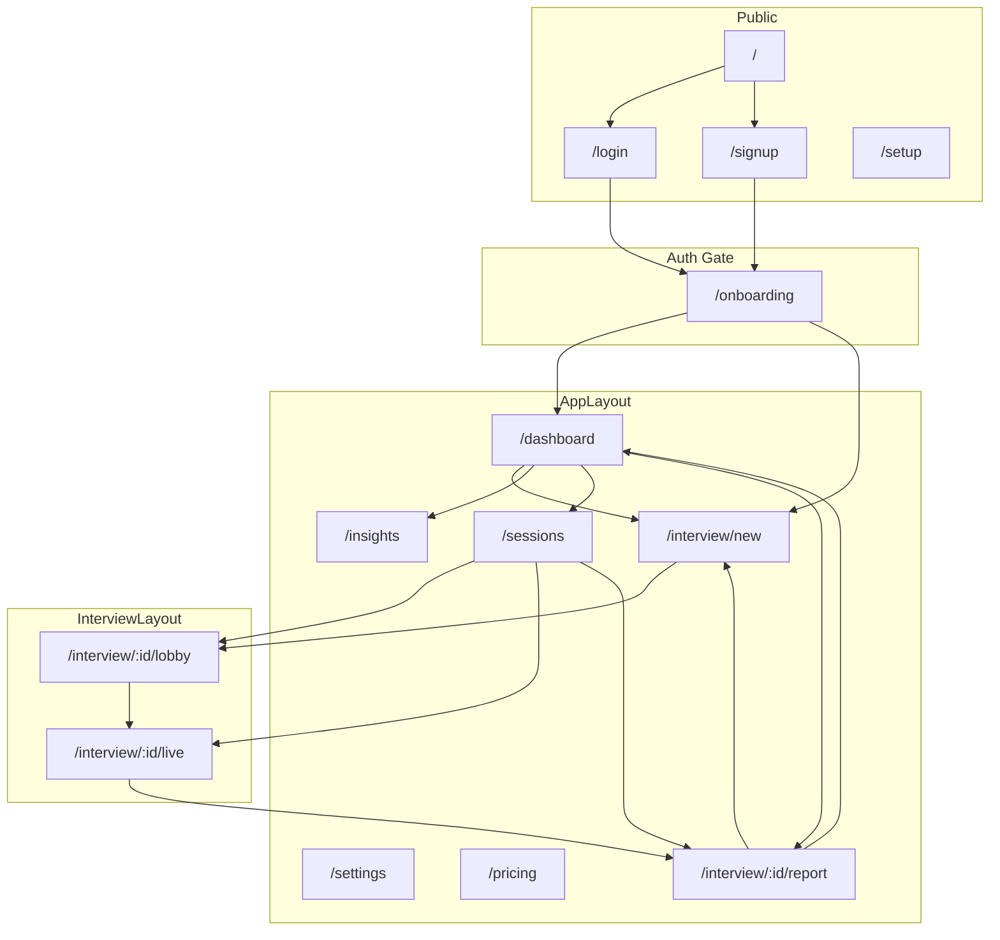

# MAJU 사이트맵 & UX 구조 (논의용)

> **목적:** 실제 앱을 보면서 정보 구조(IA)와 내비게이션을 점검하기 위한 공유 문서  
> **기준 코드:** `apps/web/src/App.jsx`, `AppSidebar.jsx` (2026-08-29)  
> **상태:** 초안 — 아래 「논의 메모」「결정 대기」 섹션에 함께 적어 가며 수정

---

## 1. 한 줄 요약

MAJU는 **3개 존**으로 나뉩니다.

| 존 | 레이아웃 | 톤 | 역할 |
|----|----------|-----|------|
| **Public** | 없음 | 라이트 | 유입 · 가입 · 로그인 |
| **App** | `AppLayout` + 사이드바 | 라이트 (#f4f6f8 캔버스) | 홈 · 기록 · 분석 · 설정 |
| **Interview** | `InterviewLayout` | 다크 | 로비 · Live 면접 |

핵심 루프:

```
로그인 → (온보딩) → 대시보드 → 새 면접 → 로비 → Live → 리포트 → 대시보드
```

---

## 2. 전체 라우트 맵 (As-Is)

### 2.1 Public (비로그인 가능)

| Route | 페이지 | Auth | 사이드바 | 설명 |
|-------|--------|------|----------|------|
| `/` | `HomePage` | — | — | 랜딩 · CTA (가입/로그인). 로그인 시 → 대시보드 유도 |
| `/login` | `LoginPage` | — | — | 이메일 로그인 |
| `/signup` | `SignupPage` | — | — | 회원가입 |
| `/setup` | `SetupPage` | — | — | Supabase 미설정 시 `ProtectedRoute`가 리다이렉트 |

### 2.2 Auth Gate

| 가드 | 조건 | 리다이렉트 |
|------|------|------------|
| `ProtectedRoute` | Supabase 미설정 | → `/setup` |
| `ProtectedRoute` | 비로그인 | → `/login` |
| `RequireOnboarding` | 온보딩 미완료 + 세션 0건 | → `/onboarding` |
| `RequireOnboarding` | 세션 1건 이상 | 온보딩 자동 skip (localStorage) |

### 2.3 App 존 (`AppLayout` — 사이드바 O)

| Route | 페이지 | 사이드바 노출 | 현재 역할 |
|-------|--------|---------------|-----------|
| `/dashboard` | `DashboardPage` | **Dashboard** | **액션 중심 홈** — 이어하기 · 추천 재도전 · KPI 한 줄 · 최근 3건 · Insights 링크 |
| `/sessions` | `SessionsPage` | **Sessions** | 전체 세션 목록 (live / draft / completed / other) |
| `/insights` | `InsightsPage` | **Insights** | 성장 분석 — 차트 · 루브릭 · 약점 TOP3 |
| `/settings` | `SettingsPage` | **Settings** | 프로필 · UI 언어 · 면접 기본값 · 로그아웃 |
| `/pricing` | `PricingPage` | Footer 배너만 | Free / Premium 플랜 소개 (결제 미연동) |
| `/interview/new` | `NewInterviewPage` | **새 면접** CTA | 면접 설정 생성 |
| `/interview/:id/report` | `InterviewReportPage` | — | 1회 리포트 · 추천 재도전 · 재도전 |
| `/interview/poc` | `InterviewPocPage` | — | dev only |

### 2.4 Interview 존 (`InterviewLayout` — 사이드바 X, 다크)

| Route | 페이지 | 설명 |
|-------|--------|------|
| `/interview/:id/lobby` | `InterviewLobbyPage` | 장치 확인 · peer 소개 · 시작 |
| `/interview/:id/live` | `InterviewLivePage` | AI 면접 진행 |
| `/interview/demo` | `InterviewDemoPage` | dev only UI 데모 |

### 2.5 온보딩 (AppLayout 밖, 사이드바 X)

| Route | 페이지 | 설명 |
|-------|--------|------|
| `/onboarding` | `OnboardingPage` | 목표 · 경험 수준 → `/interview/new` 또는 `/dashboard` |

### 2.6 Fallback

| Route | 동작 |
|-------|------|
| `*` | → `/` |

---

## 3. 사이드바 vs 실제 진입 경로

```
┌─────────────────────────────────────┐
│ Logo → /dashboard                   │
├─────────────────────────────────────┤
│ ● Dashboard      /dashboard         │  ← 앱 홈 (A안: 액션 중심)
│ ● Sessions       /sessions          │  ← 전체 기록
│ ● Insights       /insights          │  ← 깊은 분석
│ ● Settings       /settings          │
│                                     │
│ [+ 새 면접]      /interview/new     │  ← Primary CTA
├─────────────────────────────────────┤
│ LanguageSwitcher                    │
│ Premium 배너     /pricing           │  ← Settings와 별도
│ 프로필 클릭      /settings          │  ← Settings 중복 진입
└─────────────────────────────────────┘
```

**사이드바에 없지만 자주 쓰는 페이지**

- `/interview/:id/report` — 완료 카드 · Insights · Live 종료 후
- `/interview/:id/lobby`, `/live` — 대시보드 이어하기 · Sessions
- `/onboarding` — 첫 로그인 1회

---

## 3-A. 사이드바 & 메뉴 상세 (As-Is)

> `AppSidebar.jsx` 기준 · 폭 `17.5rem` · `AppLayout` 좌측 고정

### 3-A.1 사이드바 4계층 구조

| 계층 | 구성 | 성격 |
|------|------|------|
| **Header** | Logo · 앱 태그라인 | 브랜드 · `/dashboard` 링크 |
| **Primary Nav** | 4개 NavLink | 앱 주요 목적지 |
| **Action CTA** | 새 면접 | 핵심 행동 (Primary) |
| **Footer** | 언어 · 플랜 · 프로필 | 계정 · 부가 기능 |

### 3-A.2 Primary Nav (4개)

| 순서 | 라벨 (KO) | Route | 아이콘 | 메뉴 유형 | 한 줄 역할 |
|------|-----------|-------|--------|-----------|------------|
| 1 | 대시보드 | `/dashboard` | LayoutDashboard | **홈 / 액션 허브** | 지금 할 일 · 추천 연습 |
| 2 | 연습 기록 | `/sessions` | Video | **아카이브** | 전체 세션 CRUD |
| 3 | 코칭 인사이트 | `/insights` | MessageSquareText | **분석** | 성장·루브릭·약점 |
| 4 | 설정 | `/settings` | Settings | **계정·기본값** | 프로필 · UI · 면접 preset |

### 3-A.3 Action CTA (Nav 밖, 강조)

| 라벨 | Route | 스타일 | 활성 시 |
|------|-------|--------|---------|
| 새 면접 시작 | `/interview/new` | bordered → hover accent | gradient accent→highlight |

→ Nav 4개와 **분리된 5번째 항목**. 시각적으로 Primary action.

### 3-A.4 Footer (사이드바 전용, Nav 아님)

| 요소 | Route / 동작 | 비고 |
|------|--------------|------|
| LanguageSwitcher | UI locale 변경 (localStorage) | Settings에도 UI 언어 있음 → **중복** |
| Free 플랜 배너 | `/pricing` | Crown 아이콘 · amber 배경 |
| 프로필 블록 | `/settings` | 아바타 · 이름 · 이메일 · ChevronDown |

→ 프로필 `ChevronDown`은 **드롭다운 없음** (Settings로만 이동).

### 3-A.5 사이드바 **없는** App 라우트

| Route | 진입 경로 |
|-------|-----------|
| `/interview/new` | 사이드바 CTA · Dashboard · Sessions · Insights 헤더 |
| `/interview/:id/report` | SessionCard · Live 종료 · Dashboard recent |
| `/pricing` | Footer 배너만 |

---

## 3-B. 메뉴별 페이지 콘텐츠 상세

### 3-B.1 대시보드 `/dashboard`

**의도:** A안 — 「다음에 뭘 할지」 (Analytics 아님)

| 블록 | 조건 | 내용 | 다음 행동 |
|------|------|------|-----------|
| 페이지 헤더 | 항상 | 제목 · intro / introReturning | — |
| 튜토리얼 | tutorial 미 dismiss | 3단계 가이드 · dismiss · CTA | `/interview/new` |
| Empty | 세션 0 | EmptyState | 첫 면접 만들기 |
| **이어하기** | live 또는 draft 1건 | 세션명 · 상태 · 준비/계속 | lobby / live |
| **추천 재도전** | completed + report | 약점 기반 reason · CTA | `/interview/new` (prefill) |
| **첫 면접 유도** | completed 없음 | hero 카드 | `/interview/new` |
| **KPI 스트립** | completed 1+ | 평균 · delta · 완료 · streak | (정보 only) |
| **최근 면접** | 1+ (resume 제외) | compact 3건 · 삭제 | report / lobby / live |
| **인사이트 링크** | completed 1+ | teaser | `/insights` |

**데이터:** `useSessions()` — grouped, growthStats

---

### 3-B.2 연습 기록 `/sessions`

**의도:** 전체 세션 관리 (Dashboard의 「전체 보기」)

| 블록 | 내용 |
|------|------|
| PageHeader | 제목 · intro · **새 면접** (lg Button) |
| SessionGroup ×4 | live → draft → completed → other |
| SessionCard | **default** variant — 2열 그리드 · 공고 미리보기 · 삭제 |

**Dashboard와 차이**

| | Dashboard | Sessions |
|---|-----------|----------|
| 카드 | compact, 3건 | full, 전체 |
| 그룹 | 혼합 recent | 상태별 섹션 |
| CTA | 추천 재도전 | 새 면접만 |

---

### 3-B.3 코칭 인사이트 `/insights`

**의도:** Dashboard에서 빠진 **깊은 분석**

| 블ock | completed 0 | completed 1+ |
|------|-------------|--------------|
| PageHeader | empty CTA 없음 | 「약점 보완 연습하기」→ new |
| Body | EmptyState | **GrowthPanel** full |
| GrowthPanel | — | header · summary(4 KPI) · chart · rubric · weaknesses |

**GrowthPanel split 레이아웃**

1. KPI 2~4칸 (평균 · 완료 · streak)
2. 차트(3/5) | 루브릭+약점(2/5)

**Dashboard와 역할 분담 (A안)**

| Dashboard | Insights |
|-------------|----------|
| KPI 한 줄 | KPI 카드 + 차트 |
| 추천 재도전 CTA | 분석만 (재도전 CTA는 header) |
| 인사이트 링크 | — |

---

### 3-B.4 설정 `/settings`

| 섹션 | 필드 | 저장 위치 |
|------|------|-----------|
| 프로필 | displayName · email(readonly) | Supabase metadata |
| UI 언어 | select | i18n context + localStorage |
| 면접 기본값 | persona · peerIntensity · duration | localStorage (`user-preferences`) |
| 계정 | 로그아웃 | — |

**사이드바 LanguageSwitcher와 UI 언어 select → 동일 기능 2곳**

온보딩 goal/experience → **Settings에 없음** (localStorage only, 미노출)

---

### 3-B.5 새 면접 `/interview/new` (사이드바 CTA)

| 블록 | 내용 |
|------|------|
| InterviewStepper | step 0/4 |
| 폼 | title · 공고 · 치트시트 · persona · peer · duration · AI 언어 |
| Advanced | followUpDepth |
| Presets | 저장/불러오기 · recent setups |
| Prefill | Dashboard/Report 추천 재도전 state |

생성 후 → `/interview/:id/lobby`

---

### 3-B.6 요금제 `/pricing` (Footer only)

| 내용 | 상태 |
|------|------|
| Free / Premium 비교 | Premium CTA **disabled** (coming soon) |
| back | Dashboard |

---

### 3-B.7 사이드바 밖 — 면접 플로우 페이지

| 페이지 | Stepper | 사이드바 |
|--------|---------|----------|
| lobby | 1 | X (InterviewLayout) |
| live | 2 | X |
| report | 3 | O (AppLayout) — **Nav는 보이지만 Report 항목 없음** |

---

## 3-C. 메뉴 유형 분류 (IA 관점)

```
[행동]  새 면접 · 이어하기 · 추천 재도전 · Insights 연습 CTA
[기록]  Dashboard recent · Sessions 전체
[분석]  Insights (GrowthPanel)
[계정]  Settings · Pricing · Language
[플로우] new → lobby → live → report (Stepper로 연결, Nav와 부분 분리)
```

---

## 3-D. UX 피드백 (2026-08-29)

### 잘 된 점

1. **A안 Dashboard** — Insights와 역할 분리가 Nav 라벨(코칭 인사이트)과 맞음
2. **새 면접 CTA** — Nav와 시각 분리로 Primary action 명확
3. **Stepper** — Nav 4개와 별도로 면접 4단계 플로우 전달
4. **연습 기록** naming — 「Sessions」보다 MAJU 맥락에 맞음

### 문제 / 개선 제안

| # | 이슈 | 심각도 | 제안 |
|---|------|--------|------|
| 1 | **Settings 2진입** (Nav + 프로필) | 중 | Nav에서 Settings 제거하고 프로필만 / 또는 프로필→dropdown(설정·로그아웃·플랜) |
| 2 | **언어 2곳** (Footer switcher + Settings select) | 중 | Footer만 / Settings만 하나로 |
| 3 | **Dashboard ↔ Sessions 중복** (recent vs 전체) | 중 | 유지 OK — 단 Sessions를 Nav에서 「기록」으로 두고 Dashboard는 「홈」only 강조 |
| 4 | **Insights vs Dashboard KPI** | 낮 | A안 의도대로 — Insights 미방문 사용자는 KPI만으로 충분한지 UX 테스트 |
| 5 | **Insights에 추천 재도전 없음** | 중 | GrowthPanel 아래 Dashboard와 동일 RecommendedRetry 추가 검토 |
| 6 | **Report Nav 부재** | 중 | 완료 직후 Report에서 사이드바 「대시보드」만 — Report 전용 breadcrumb/stepper 유지 권장 |
| 7 | **프로필 ChevronDown 기대치** | 중 | 드롭다운 없음 → 아이콘 제거 or 메뉴 구현 |
| 8 | **Pricing 위치** | 낮 | Settings 「플랜」탭 통합 or Footer 유지 — 결제 전까지 노출 줄이기 |
| 9 | **온보딩 데이터 미활용** | 중 | Settings에 「연습 목표」표시 or Dashboard 인사말 개인화 |
| 10 | **Nav 4개 + CTA 5개** | 낮 | 초보에게 많을 수 있음 — Insights를 Dashboard 하위로 합치면 3+CTA |

### 추천 Nav 구조 (To-Be 후보)

**Option A — 현재 유지 + Footer 정리**

```
대시보드 | 연습 기록 | 코칭 인사이트
[새 면접]
─────────
언어 | 프로필▾ (설정·로그아웃·플랜)
```

**Option B — 3 Nav (Insights 흡수)**

```
홈(대시보드+인사이트 탭) | 연습 기록 | [새 면접]
프로필▾
```

**Option C — Settings Nav 제거**

```
대시보드 | 연습 기록 | 코칭 인사이트 | [새 면접]
Footer: 언어 · 플랜 · 프로필▾(설정)
```

---

## 3-E. CTA 중복 맵

「새 면접 / 연습」으로 가는 버튼 위치:

| 위치 | 라벨 |
|------|------|
| Sidebar | 새 면접 시작 |
| Dashboard hero | 새 면접 / 추천 재도전 |
| Dashboard tutorial | 첫 면접 만들기 |
| Dashboard empty | 첫 면접 만들기 |
| Sessions header | 새 면접 |
| Insights header | 약점 보완 연습하기 |
| Insights empty | 첫 면접 만들기 |
| Report footer | 새 면접 · 재도전 |

→ **의도적 반복** (어디서든 시작 가능)이나, 라벨 통일 (`새 면접 시작` vs `약점 보완 연습하기`) 검토 필요.

---


`InterviewStepper` 4단계:

| # | 단계 | Route | 레이아웃 |
|---|------|-------|----------|
| 0 | 만들기 | `/interview/new` | App |
| 1 | 준비 | `/interview/:id/lobby` | Interview |
| 2 | 진행 | `/interview/:id/live` | Interview |
| 3 | 결과 | `/interview/:id/report` | App |

**세션 상태 (`SessionStatus`)**

| status | 의미 | 주요 이동 |
|--------|------|-----------|
| `draft` | 설정만 저장 | → lobby |
| `live` | 면접 진행 중 | → live |
| `completed` | 종료 + 리포트 | → report |
| `aborted` | (기타) | Sessions · other 그룹 |

---

## 5. 페이지별 책임 (의도한 역할)

| 페이지 | 사용자 질문 | 답 |
|--------|-------------|-----|
| **Dashboard** | 지금 뭘 하면 되지? | 이어하기 · 추천 재도전 · 최근 3건 |
| **Sessions** | 내 면접 기록 전부 어디? | 상태별 전체 목록 · 삭제 |
| **Insights** | 나 어디가 약하지? | 차트 · 루브릭 · 반복 약점 |
| **New Interview** | 새 연습 어떻게 만들지? | 공고 · 페르소나 · 언어 · peer |
| **Report** | 이번 면접 어땠지? | 점수 · 타임라인 · 추천 재도전 |
| **Settings** | 내 계정/기본값? | 프로필 · 언어 · 기본 면접 옵션 |
| **Pricing** | 유료는 뭐가 다른데? | 플랜 비교 (결제 X) |

---

## 6. 사용자 여정 (3 persona)

### A. 신규 사용자 (면접 0회)

```
/ → /signup → /onboarding → /interview/new 또는 /dashboard
                              ↓
                    Dashboard: 튜토리얼 + 「첫 면접 만들기」
```

### B. 재방문 (완료 1회+)

```
/dashboard
  ├─ [이어하기]        (draft/live 있을 때)
  ├─ [추천 재도전]     → /interview/new (prefill)
  ├─ KPI 한 줄
  ├─ 최근 3건
  └─ /insights 링크
```

### C. 분석만 보고 싶을 때

```
/insights  (또는 Dashboard → 「인사이트 더 보기」)
/sessions  (특정 리포트 클릭 → /interview/:id/report)
```

---

## 7. 현재 UX에서 눈에 띄는 이슈 (논의 포인트)

아래는 코드·구조 기준 **관찰**입니다. 맞/틀림은 실제 사용감으로 확인 필요.

### 7.1 정보 중복

| 내용 | Dashboard | Sessions | Insights | Report |
|------|-----------|----------|----------|--------|
| 세션 목록 | 최근 3 | 전체 | — | — |
| 추천 재도전 | ✅ 메인 CTA | — | — | ✅ |
| 성장 차트/루브릭 | — (KPI만) | — | ✅ | 일부 |
| 삭제 | ✅ compact | ✅ | — | — |

→ **Sessions vs Dashboard** 최근 목록 겹침  
→ **Report vs Dashboard** 추천 재도전 겹침 (의도적일 수 있음)

### 7.2 내비게이션

- **Settings**가 사이드바 + 하단 프로필 **2곳**에서 진입
- **Pricing**은 사이드바 하단만 (Settings와 분리 — 의도?)
- **Report**는 사이드바 없음 → 뒤로가기는 리포트 내 버튼에 의존
- **New Interview**는 사이드바 CTA + Dashboard hero + Sessions 헤더 **3곳**

### 7.3 레이아웃 전환

- App(라이트) ↔ Interview(다크) 전환이 abrupt — 기존 UI_UX_PLAN 이슈 #5
- Report는 App 레이아웃이지만 면접 직후 맥락 — Stepper 3단계 표시 O

### 7.4 온보딩

- goal / experienceLevel 저장은 **localStorage만** — Dashboard·Insights에서 아직 미활용
- 세션 1건 있으면 온보딩 skip → 첫 사용자가 설정만 만들고 나가면 온보딩 영구 skip

### 7.5 미구현·placeholder

- Pricing: 결제/waitlist redeem 미연동
- Settings: plan 표시 제한적
- B2B / billing / 파일 업로드 등 — 라우트 없음

---

## 8. 구조 다이어그램



---

## 9. To-Be 후보 (아직 결정 X)

실 UX 보면서 아래 중 골라/조합.

### Option 1 — 현재 유지 + 미세 조정 (A안 dashboard 확정)

- Dashboard = 액션 홈
- Insights = 분석 전용
- Sessions = 아카이브

**추가 검토**

- Dashboard 최 recent 3 → 2로 줄이거나 Sessions와 차별화 강화
- Report 하단 CTA와 Dashboard 추천 재도전 문구 통일

### Option 2 — Sessions 흡수

- `/sessions` 제거 또는 「더 보기」 모달
- 사이드바: Dashboard · Insights · Settings

**장점:** 항목 단순  
**단점:** 기록 많아지면 Dashboard 비대

### Option 3 — Insights를 Dashboard 하위로

- 사이드바에서 Insights 제거
- Dashboard KPI → 「자세히」가 같은 페이지 내 앵커 또는 탭

**장점:** IA 단순  
**단점:** 분석 UI 무거워지면 A안 철학과 충돌

### Option 4 — Report 허브 강화

- 완료 후 Report가 유일한 「다음 행동」 허브
- Dashboard는 Report 요약 링크만

**장점:** 1회 면접 루프 명확  
**단점:** 재방문 시 Dashboard 가치 하락

---

## 10. 결정 대기 (체크리스트)

실제 앱 보면서 채워 주세요.

| # | 질문 | 선택지 | 결정 |
|---|------|--------|------|
| 1 | 사이드바에 **Sessions** 유지? | 유지 / Dashboard에 흡수 / 이름 변경(기록) | |
| 2 | 사이드바에 **Insights** 유지? | 유지 / Dashboard 탭 / Report에 통합 | |
| 3 | **Pricing** 위치 | 사이드바 / Settings 내부 / 제거 | |
| 4 | **Report** 뒤로가기 | Dashboard 고정 / 이전 페이지 / Sessions | |
| 5 | **온보딩** goal 데이터 | Dashboard 반영 / Settings / 미사용 | |
| 6 | 신규 사용자 첫 화면 | Dashboard / New Interview 직행 | |
| 7 | dev `/interview/demo` | Dashboard 버튼 / Settings / 제거 | |

---

## 11. 논의 메모

> 실제 UX 보면서 여기에 자유롭게 적어 주세요.

### 2026-08-29

- Dashboard **A안** 적용: GrowthPanel → Insights 이동, Dashboard는 액션 중심
- 사이트맵 문서 초안 작성

### (다음 메모)

- 
- 

---

## 12. 관련 파일

| 구분 | 경로 |
|------|------|
| 라우팅 | `apps/web/src/App.jsx` |
| 사이드바 | `apps/web/src/components/AppSidebar.jsx` |
| 레이아웃 | `apps/web/src/layouts/AppLayout.jsx`, `InterviewLayout.jsx` |
| 가드 | `ProtectedRoute.jsx`, `RequireOnboarding.jsx` |
| 대시보드 | `pages/DashboardPage.jsx` |
| 기획 문서 | `docs/UI_UX_PLAN.md`, `docs/IMPLEMENTATION_PLAN.md` |

---

## 13. 다음 단계 제안

1. **앱 직접 클릭** — 신규 / 재방문 / 면접 중 3 시나리오 녹화 or 스크린샷
2. **§10 결정표** 7항목 채우기
3. 결정 반영 → 라우트·사이드바·리다이렉트 수정
4. 이 문서 `결정` 열 업데이트 후 `UI_UX_PLAN.md`와 동기화
